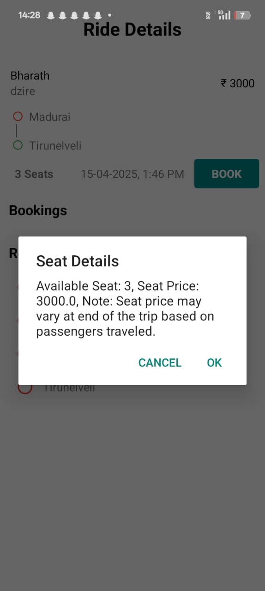
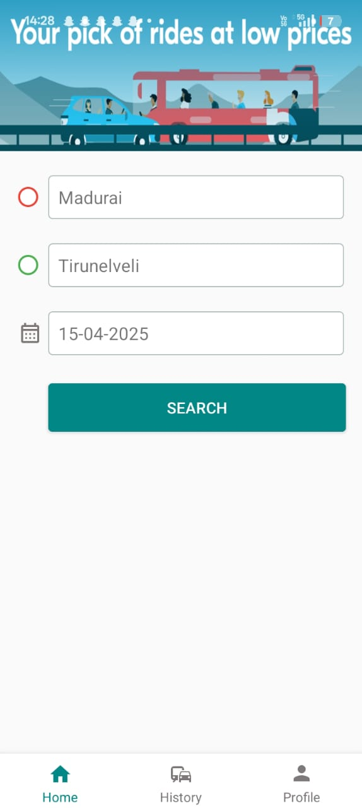
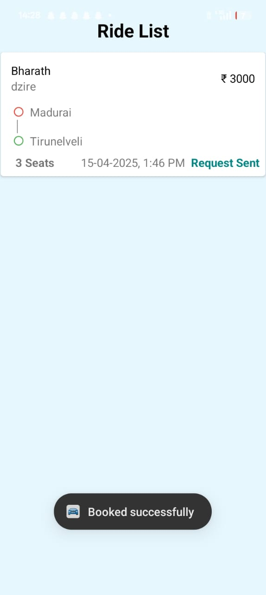
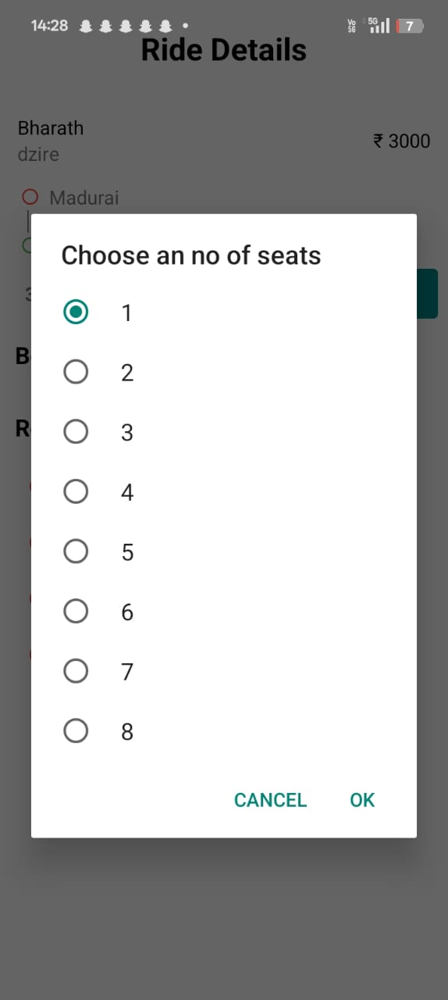
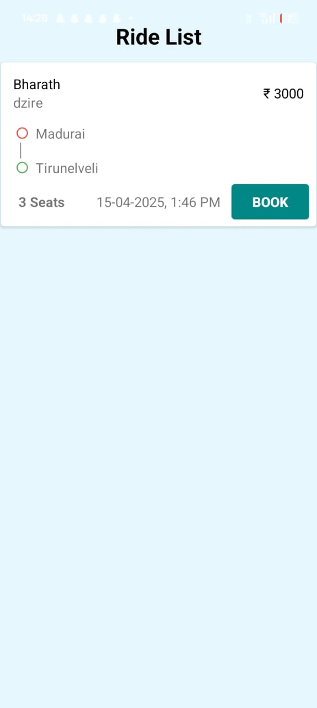

# 📱 PlanC – Ride-Sharing Android Application

**PlanC** is an Android-based ride-sharing application designed to connect users traveling along similar routes, providing an affordable and convenient way to share car rides. This platform promotes cost-effective, eco-friendly travel while fostering community connections.

---

## 📖 Abstract  

PlanC bridges the gap between individual travelers heading in the same direction by allowing car owners to offer available seats in their vehicles for specific trips. Travelers can search for and book suitable rides at reduced costs, contributing to a sustainable and connected commuting experience.

---

## 🚀 Features  

- **User Registration & Authentication** for both car owners and customers.
- **Car Owner Dashboard**:
  - Publish rides by providing source and destination.
  - Specify date, time of travel, number of available seats, and car details.
  - View published rides and manage booking requests.
  - Accept/reject customer requests.
  - Track customer location after booking acceptance.
- **Customer Interface**:
  - Search available rides based on source, destination, and time.
  - View available rides, ride details, and other customer booking details (name, age, gender).
  - Book rides and receive real-time booking status updates.
- **Ride History**: Both owners and customers can view their ride and booking history.
- **Location Tracking** for car owners to pick up customers after booking acceptance.

---

## 🛠️ Technologies Used  

- **IDE:** Android Studio  
- **Languages:** Kotlin, Java  
- **UI Design:** XML  

---

## 📷 Screenshots  
    <video controls src="output6.mp4" title="alt text"></video>

---

## 📌 Installation  

1. Clone the repository:
   ```bash
   git clone https://github.com/YourUsername/PlanC-RideSharingApp.git
